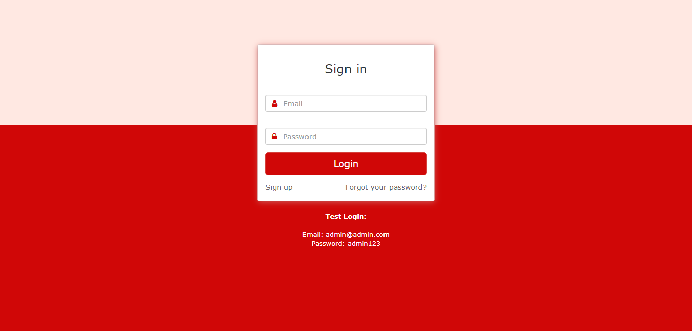
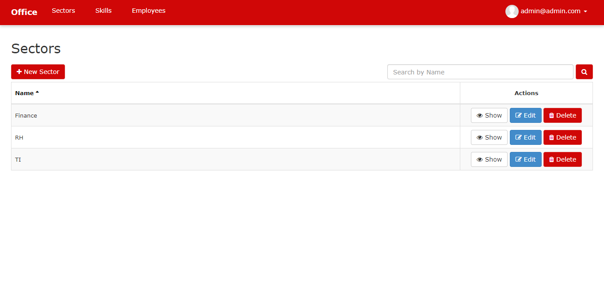
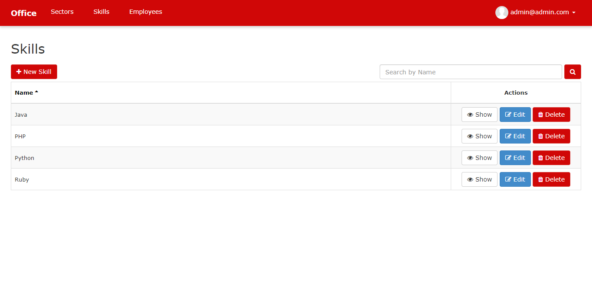
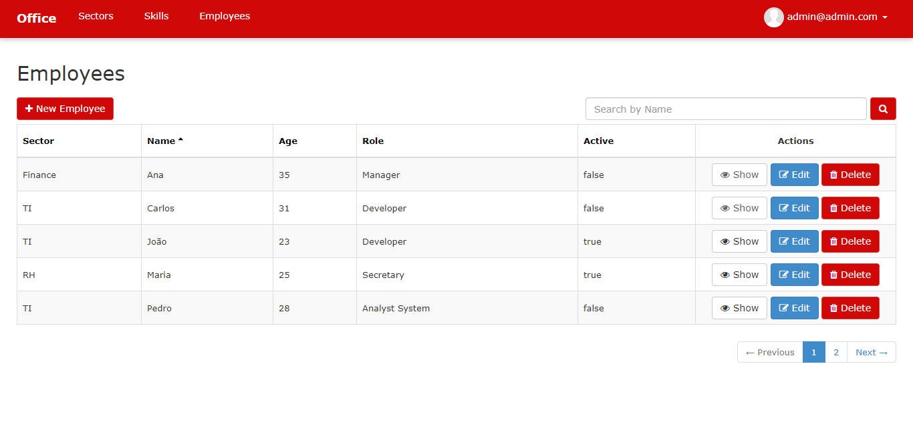
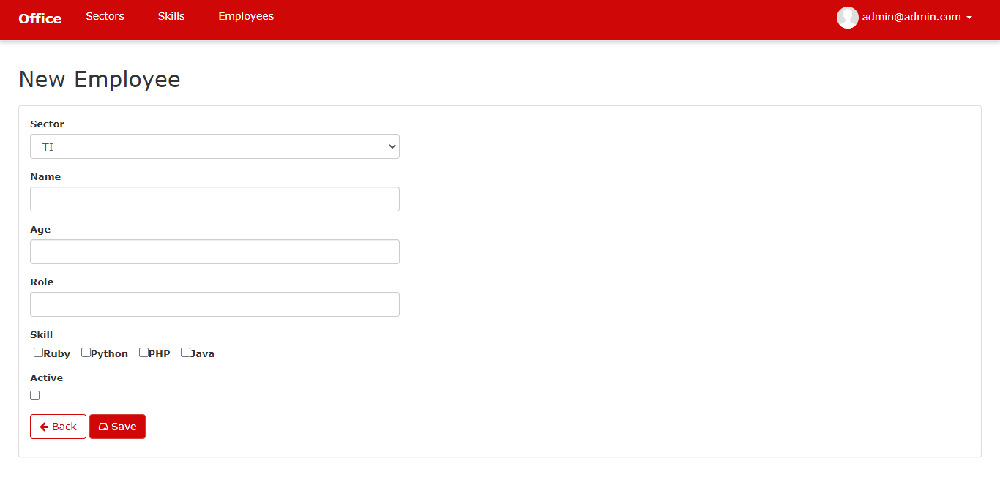
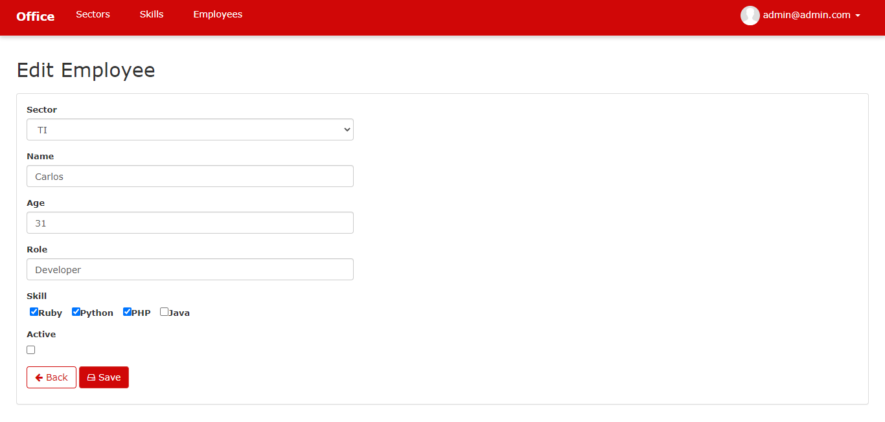
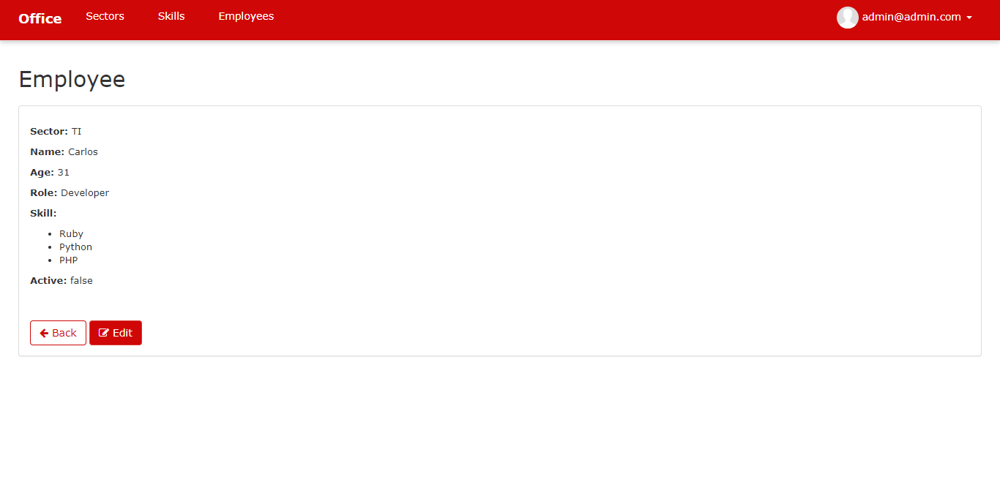
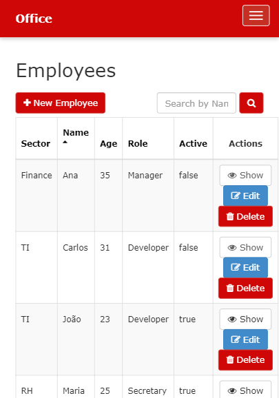

# CRUD COM RAILS 
👨‍💻CRUD DE RECURSOS HUMANOS COM RUBY ON RAILS E SQLITE.

 <br>
 <br>
 <br>
 <br>
 <br>
 <br>
 <br>
 <br>

## DESCRIÇÃO:
Este aplicativo, denominado `CRUD COM RAILS`, é um sistema de gerenciamento de recursos humanos que permite a administração de setores, habilidades, funcionários e suas informações associadas.

## PRINCIPAIS RECURSOS:
1. **Navegação:**
   - Após fazer login, você será redirecionado para a página principal do sistema, onde poderá acessar diferentes seções, incluindo Setores, Habilidades e Funcionários através do menu de navegação superior.

2. **Gerenciamento de Setores:**
   - A seção de Setores permite que você visualize, adicione, edite e exclua diferentes setores da organização.
   - Cada setor possui um nome único e pode ser editado ou excluído conforme necessário.

3. **Gerenciamento de Habilidades:**
   - Na seção de Habilidades, você pode visualizar, adicionar, editar e excluir habilidades que os funcionários possuem.
   - Cada habilidade possui um nome único e pode ser editada ou excluída conforme necessário.

4. **Gerenciamento de Funcionários:**
   - A seção de Funcionários permite visualizar, adicionar, editar e excluir informações sobre os funcionários da organização.
   - Cada funcionário tem informações associadas, como nome, idade, função, setor, habilidades e status de ativação.
   - Você pode pesquisar funcionários por nome e ordenar os resultados conforme necessário.
   - Além disso, é possível adicionar ou editar informações de funcionários, incluindo o setor ao qual estão associados e suas habilidades.

## EXECUTANDO O PROJETO:
1. **Instalação das Dependências:**
   Antes de executar o aplicativo, certifique-se de instalar as dependências do projeto. No terminal, navegue até o diretório `./CODIGO` e execute o comando abaixo para instalar as dependências necessárias:
   ```bash
   gem install rake
   ```

   ```bash
   gem install bundler && bundle install
   ```

2. **Executar Migrações:**
   Use o comando abaixo para executar migrações no banco de dados:

   ```bash
   rake db:migrate
   ```

3. **Subindo o servidor:**
   Após instalar as dependências, ainda no terminal e no mesmo diretório (`./CODIGO`), execute o seguinte comando para iniciar o aplicativo:

  **LINUX/MACOS:**
   ```
   bin/rails server
   ```

   **WINDOWS:**
   ```
   ruby bin\rails server
   ```

4. **Acesso à Aplicação:** 
   Após iniciar o servidor Rails localmente, você pode acessar a aplicação através do navegador digitando [http://localhost:3000](http://localhost:3000).

5. **Faça o login:**
   - Para acessar a área de administração, utilize as seguintes credenciais:
     - **Email:** admin@admin.com
     - **Senha:** admin123

   - Essas são as credenciais padrão para acesso à área administrativa. Certifique-se de alterar a senha após o login inicial por motivos de segurança.

6. **Usando o APP:**
   1. **Navegue:**
      - Após fazer login, seja redirecionado para a página principal do sistema. Acesse diferentes seções, incluindo Setores, Habilidades e Funcionários através do menu de navegação superior.

   2. **Gerencie Setores:**
      - Visualize, adicione, edite e exclua diferentes setores da organização na seção de Setores.
      - Cada setor possui um nome único e pode ser editado ou excluído conforme necessário.

   3. **Gerencie Habilidades:**
      - Visualize, adicione, edite e exclua habilidades que os funcionários possuem na seção de Habilidades.
      - Cada habilidade possui um nome único e pode ser editada ou excluída conforme necessário.

   4. **Gerencie Funcionários:**
      - Visualize, adicione, edite e exclua informações sobre os funcionários da organização na seção de Funcionários.
      - Cada funcionário possui informações associadas, como nome, idade, função, setor, habilidades e status de ativação.
      - Pesquise funcionários por nome e ordene os resultados conforme necessário.
      - Adicione ou edite informações de funcionários, incluindo o setor ao qual estão associados e suas habilidades.

## TECNOLOGIAS:
- [Ruby](https://github.com/VILHALVA/CURSO-DE-RUBY)
- [Rails](https://github.com/VILHALVA/CURSO-DE-RUBY-ON-RAILS)
- [CSS e SCSS](https://github.com/VILHALVA/CURSO-DE-HTML-E-CSS)
- [JS](https://github.com/VILHALVA/CURSO-DE-JAVASCRIPT)
- [Bootstrap](https://github.com/VILHALVA/CURSO-DE-BOOTSTRAP)
- [SQLite](https://github.com/VILHALVA/CURSO-DE-SQLITE)

## CREDITOS:
- [PROJETO CRIADO PELO "danilomeneghel"](https://github.com/danilomeneghel/crud-ruby-rails)
- [PROJETO FEITO PELO VILHALVA](https://github.com/VILHALVA)


